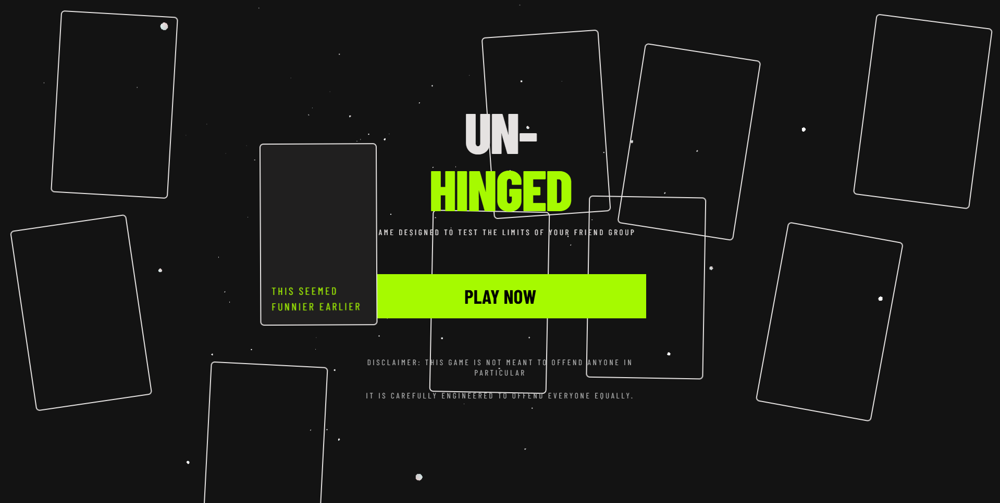
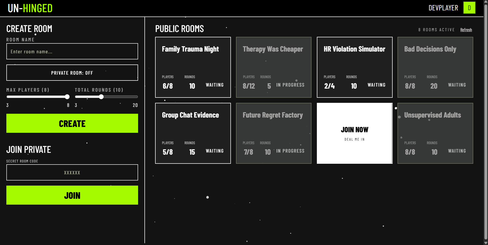
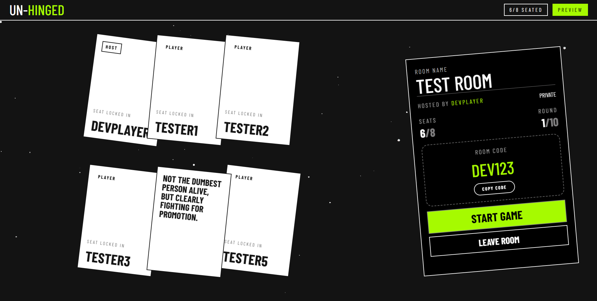
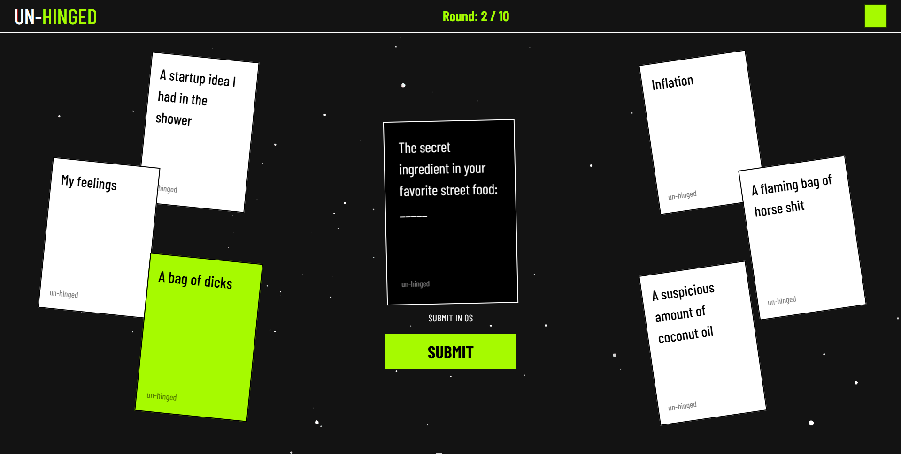
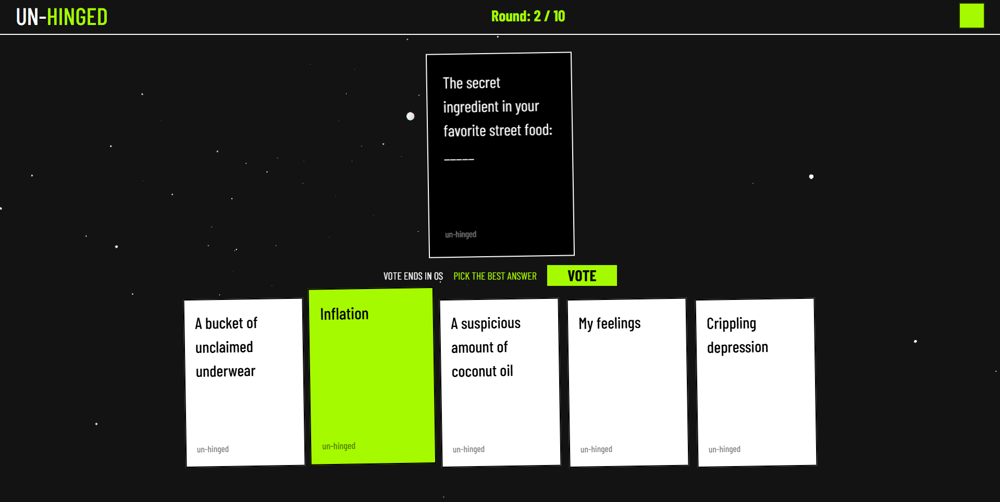
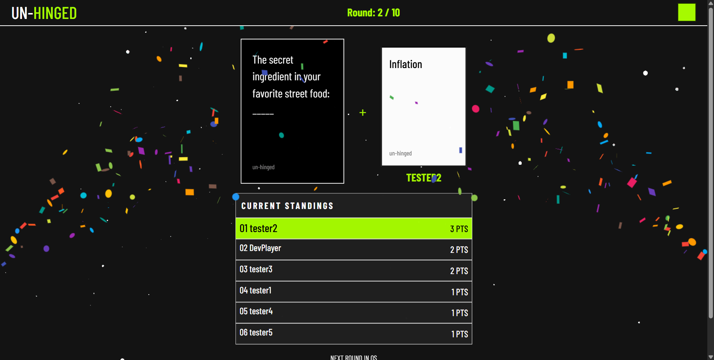

# Un-Hinged

A real-time multiplayer card game inspired by Cards Against Humanity. Players join public or private lobbies and compete through submit → vote → results round cycles, with all game state synchronized across clients via WebSockets.

No sign-up required — guest sessions are created automatically.

## Screenshots

<table>
  <tr>
    <td align="center"><br/><sub><b>Landing Page</b></sub></td>
    <td align="center"><br/><sub><b>Lobby Browser</b></sub></td>
  </tr>
  <tr>
    <td align="center"><br/><sub><b>Room / Waiting Page</b></sub></td>
    <td align="center"><br/><sub><b>Submitting Phase</b></sub></td>
  </tr>
  <tr>
    <td align="center"><br/><sub><b>Voting Phase</b></sub></td>
    <td align="center"><br/><sub><b>Results Phase</b></sub></td>
  </tr>
</table>

## Tech Stack

| Layer     | Tech                                                   |
| --------- | ------------------------------------------------------ |
| Frontend  | React, TypeScript, Vite, Tailwind CSS, React Router v6 |
| Backend   | Node.js, Express, TypeScript, Socket.io                |
| Database  | PostgreSQL (Neon), raw SQL, no ORM                     |
| Real-time | Socket.io (persistent WebSocket connections)           |
| Shared    | TypeScript types shared across client and server       |

## Architecture

Communication is split across two layers:

- **REST** (`/rooms`, `/users`) — room creation, joining, guest user provisioning, and other lifecycle operations
- **WebSocket** (Socket.io) — drives all real-time game events: phase transitions, card submissions, votes, round results, and score updates

The server emits events (`phase:vote`, `round:end`, `round:start`, `game:end`, `room:reset:done`) that all connected clients in a room receive simultaneously. Server-side `setTimeout` timers enforce submission and voting deadlines automatically if a player is inactive, without breaking room state for other players.

**State model:** all active gameplay state — rooms, players, hands, rounds, submissions, votes — lives in an in-memory cache (`roomCache`) on the server. The cache is the single source of truth while a room is active; there are no per-action database round-trips during gameplay. Postgres (hosted on Neon) is only touched once, at room creation, purely to persist a row for room counting/bookkeeping. There is no live schema for rounds, hands, submissions, or votes — that data only ever exists in memory and is discarded when a room is torn down.

A `shared/types/index.ts` module is imported by both the client and server, enforcing strict TypeScript contract compatibility across all Socket.io event payloads and REST responses at compile time.

```
client/          # React frontend
server/          # Express + Socket.io backend
  src/
    cache/       # In-memory room cache (source of truth during gameplay)
    db/          # Minimal raw SQL layer (room creation/bookkeeping only)
    routes/      # REST routers
    index.ts     # Server bootstrap + socket event handlers
shared/
  types/         # Shared TypeScript types (client + server)
```

## Game Flow

1. Guest session created on load (UUID, no auth required)
2. Create a new room or join via public lobby / private room code
3. Host starts the game
4. Each round: black card is shown → players submit a white card → all players vote → winner revealed → scores updated
5. Game ends after the configured number of rounds, or resets early if active players drop below 3 mid-game
6. Host can manually reset the room back to the lobby between games; host privileges automatically transfer if the current host leaves

## Local Setup

```bash
# Clone the repo
git clone https://github.com/mohitagarwal11/messed-up-cards
cd messed-up-cards

# Install dependencies for client and server
npm run install:all

# Set up environment variables
cp server/.env.example server/.env
# Add your DATABASE_URL to server/.env (Neon Postgres connection string)

# Run client and server concurrently
npm run dev
```

Client runs on `http://localhost:5173`, server on `http://localhost:3001`.

You'll need a Neon (or any Postgres) database — the only table needed is for room bookkeeping at creation time.

## Credits

Card content is sourced from the official [Cards Against Humanity](https://www.cardsagainsthumanity.com/) base deck, released under the [Creative Commons BY-NC-SA 2.0](https://creativecommons.org/licenses/by-nc-sa/2.0/) license. Cards have been filtered for content tiers and are used here on a non-commercial basis. Un-Hinged is an independent project and is not affiliated with or endorsed by Cards Against Humanity, LLC.
